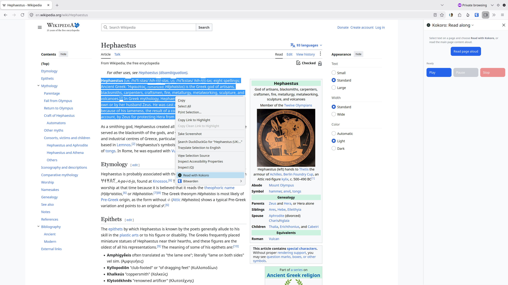
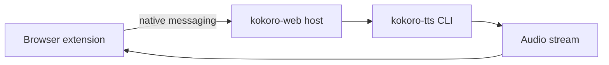

<div align="center">


# Kokoro Web

**Read text aloud in your browser — powered by local [kokoro-tts](https://github.com/nazdridoy/kokoro-tts).**

<!-- Install Buttons -->

[](https://github.com/atb00ker/kokoro-web-addon/releases/latest)
[](https://addons.mozilla.org/firefox/addon/kokoro-tts/)

[](https://www.python.org/)
[](https://www.typescriptlang.org/)
[](docs/DEV.md)
[](docs/PRIVACY.md)
[](https://github.com/nazdridoy/kokoro-tts)
[](LICENSE)

</div>

> [!NOTE]
> This project stands on the shoulders of the [Kokoro TTS](https://github.com/nazdridoy/kokoro-tts) team. **Kokoro Web** is only a browser extension and native messaging bridge — the model, voices, and synthesis engine are entirely their work. Thank you to everyone who built and maintains kokoro-tts for doing the difficult part that makes this add-on possible. This project is not affiliated with the Kokoro TTS team.

> [!CAUTION]
> **This project does not provide TTS services.** It is a browser extension and native messaging bridge only. You must install [kokoro-tts](https://github.com/nazdridoy/kokoro-tts) and the Kokoro model files on your system — your machine runs the actual text-to-speech engine. This setup is more involved than click-and-install.

This codebase has been tested on **Linux (Debian)** with **Chromium** and **Firefox** only. If you encounter issues with other browsers or operating systems, please open an issue and I'll try to help.

## Features

- **Local and private** — synthesis runs on your machine; nothing is sent to the cloud
- **Popup** — paste text, pick voice and speed, play/pause/stop
- **Read anywhere** — select text on any page → right-click → **Read with Kokoro**
- **Read page** — read the main page content from the context menu, popup, or read-along sidebar
- **Read-along sidebar** — follow along while text is spoken (Firefox sidebar / Chrome side panel)
- **Flexible setup** — works with your existing `kokoro-tts` install and model files

<p align="center">
  
</p>
<p align="center"><em>Select text → <strong>Read with Kokoro</strong>, or open the read-along sidebar to read the full page.</em></p>

See our [Privacy Policy](docs/PRIVACY.md) — no cloud, no analytics, no data sent to the developer.

## Installation

### Browser Store

Install from **[Firefox Add-ons](https://addons.mozilla.org/firefox/addon/kokoro-tts/)** or the **[Chrome release](https://github.com/atb00ker/kokoro-web-addon/releases/latest)** (use the badges at the top), restart your browser, and open the extension.

### Direct Install

Prefer not to use a browser store? Download the extension zip from **[GitHub Releases](https://github.com/atb00ker/kokoro-web-addon/releases/latest)** (`kokoro-web-*-firefox.zip` or `kokoro-web-*-chrome.zip`), extract it, and load it manually.

**Firefox:** open `about:debugging` → **This Firefox** → **Load Temporary Add-on…** → select `manifest.json` inside the extracted folder.

**Chromium:** open `chrome://extensions` → enable **Developer mode** → **Load unpacked** → select the extracted folder.

If you have not run setup yet, register the native host once (covers Firefox and Chrome):

```bash
kokoro-web-setup
```

Restart the browser, open the extension, and click **Test connection**.

## Quick start

### Step 1 — Install kokoro-tts and model files

```bash
uv tool install kokoro-tts

mkdir -p ~/.kokoro && cd ~/.kokoro
wget https://github.com/nazdridoy/kokoro-tts/releases/download/v1.0.0/voices-v1.0.bin
wget https://github.com/nazdridoy/kokoro-tts/releases/download/v1.0.0/kokoro-v1.0.onnx
```

### Step 2 — Install the browser bridge

```bash
uv run pip install kokoro-web
uv run kokoro-web-setup
```

> The setup command registers the native host for browsers it detects (Firefox, Chrome, Chromium, Edge, Brave). To install for a specific browser, use the corresponding command below:
>
> | Browser  | Command                            |
> | -------- | ---------------------------------- |
> | Firefox  | `uv run kokoro-web-setup firefox`  |
> | Chrome   | `uv run kokoro-web-setup chrome`   |
> | Chromium | `uv run kokoro-web-setup chromium` |
> | Edge     | `uv run kokoro-web-setup edge`     |
> | Brave    | `uv run kokoro-web-setup brave`    |
>
> To register the native host for **all** supported browsers, use:
> `uv run kokoro-web-setup --all`

### Step 3 — Install the extension

Install from **[Firefox Add-ons](https://addons.mozilla.org/firefox/addon/kokoro-tts/)** or the **[Chrome release](https://github.com/atb00ker/kokoro-web-addon/releases/latest)** (use the badges at the top), restart your browser, and open the extension.

> The first time you open it, click **Test connection**. If setup succeeded, you can paste text and press **Play**.

## Usage

| Where                  | What you can do                                                       |
| ---------------------- | --------------------------------------------------------------------- |
| **Popup**              | Paste text, choose voice/speed, play/pause/stop, **Read page**        |
| **Context menu**       | Select text → **Read with Kokoro**, or **Read page with Kokoro**      |
| **Read-along sidebar** | **Read page aloud**, play/pause/stop, search and follow along in text |

## Advanced paths

Open extension **Settings** → **Advanced paths** if kokoro-tts is not on your PATH or models live somewhere other than `~/.kokoro`. The bridge auto-detects common locations when possible.

## Why is a bridge required?

Browsers cannot run local programs directly from an extension (security). The `kokoro-web` pip package registers a tiny native messaging host that forwards requests to your installed `kokoro-tts` and streams audio back to the browser.



Firefox and Chrome use the **same** Python host script. They only differ in where the registration JSON file is stored.

## Troubleshooting

<details>
<summary><strong>Setup command not run</strong></summary>

If the extension shows "One-time setup required", run:

```bash
pip install kokoro-web && kokoro-web-setup
```

By default, setup registers only browsers it detects on your system. To force a specific browser:

```bash
kokoro-web-setup edge
```

To register every supported browser:

```bash
kokoro-web-setup --all
```

Restart the browser, then click **Test connection**.

</details>

<details>
<summary><strong>Verify native host registration</strong></summary>

Firefox (Linux):

```bash
cat ~/.mozilla/native-messaging-hosts/com.kokoro.web.json
```

Firefox (macOS):

```bash
cat ~/Library/Application\ Support/Mozilla/NativeMessagingHosts/com.kokoro.web.json
```

Chrome or Chromium (Linux):

```bash
cat ~/.config/google-chrome/NativeMessagingHosts/com.kokoro.web.json
```

Chrome (macOS):

```bash
cat ~/Library/Application\ Support/Google/Chrome/NativeMessagingHosts/com.kokoro.web.json
```

Chrome (Windows):

```bat
reg query "HKCU\Software\Google\Chrome\NativeMessagingHosts\com.kokoro.web"
```

If you upgraded from an older release, you can remove the legacy Firefox manifest:

```bash
rm -f ~/.mozilla/native-messaging-hosts/com.kokoro.web_addon.json
```

</details>

<details>
<summary><strong>kokoro-tts works in terminal but not the extension</strong></summary>

- Confirm model files are in the configured model directory
- Open **Settings** → **Advanced paths** and set the full path to your `kokoro-tts` binary
- Click **Test connection** again

</details>

## Developers

Want to run the extension from source, change the bridge, or contribute? <br /> See **[developer guide](docs/DEV.md)** for prerequisites, setup, and the local development workflow. Pull requests are welcome.
